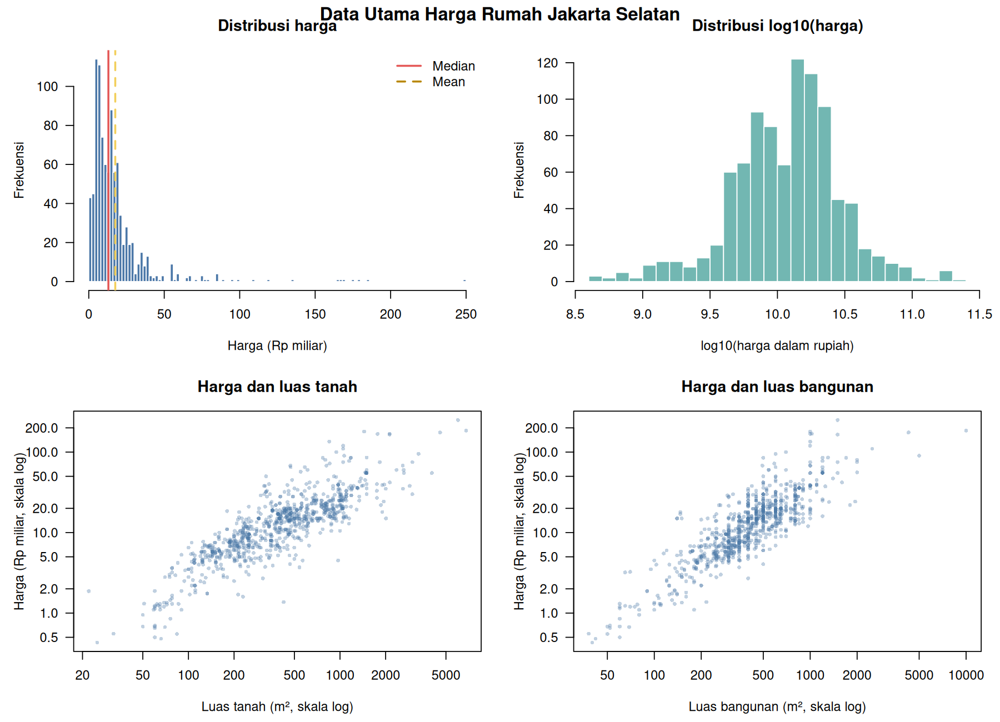
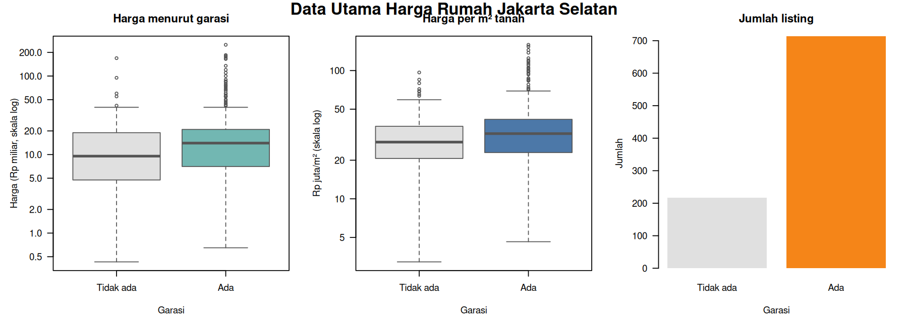
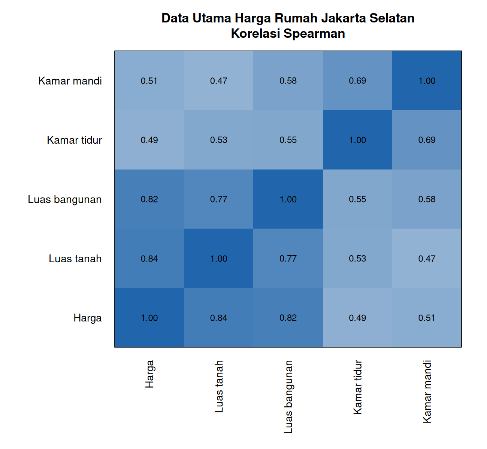
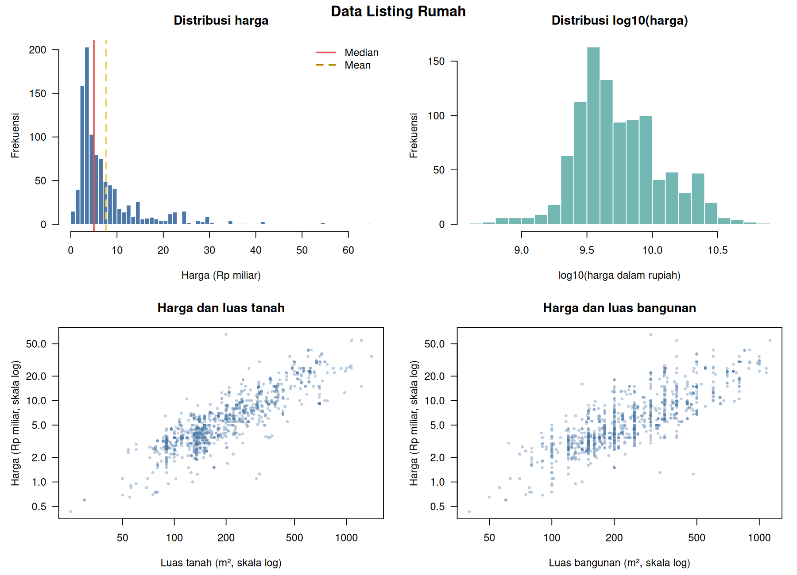
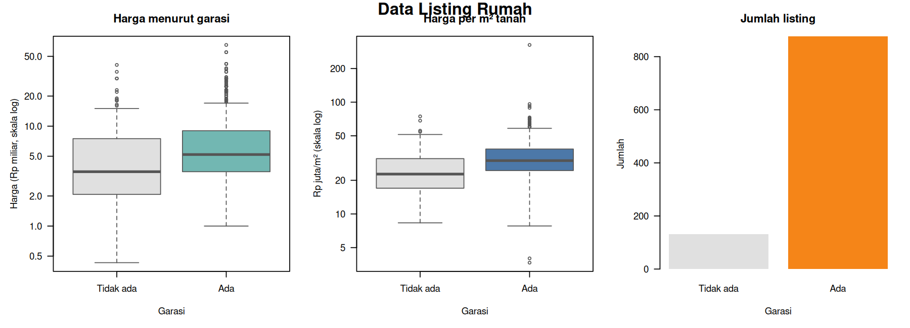
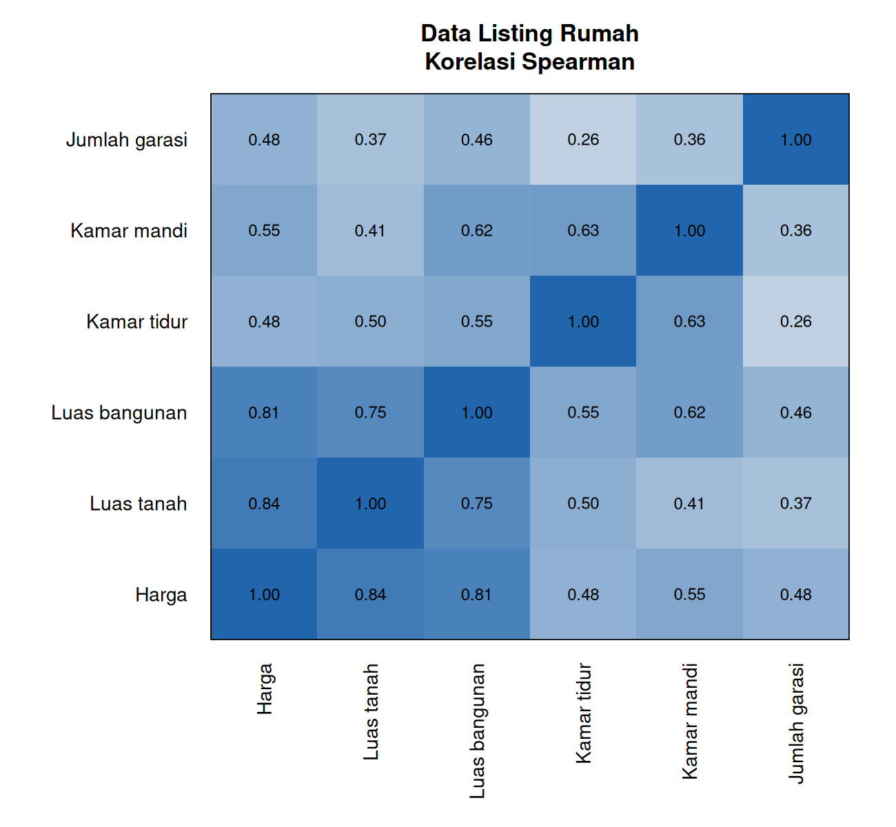

# Analisis Deskriptif Harga Rumah Jakarta Selatan

Analisis ini menggunakan data yang telah dibersihkan. Duplikat telah dikeluarkan, sedangkan pencilan tetap dipertahankan. Seluruh angka harga menggambarkan harga pada dataset/listing, bukan harga transaksi yang telah diverifikasi.

## Data utama Jakarta Selatan

Jumlah observasi: **931 rumah**. Seluruh observasi berkategori Jakarta Selatan.

- Median harga adalah **Rp13,00 miliar**, dengan 50% data berada antara **Rp6,75 miliar** dan **Rp20,00 miliar**.
- Mean harga sebesar **Rp17,55 miliar**, lebih tinggi daripada median. Ini menunjukkan distribusi menceng ke kanan karena sebagian listing berharga sangat tinggi.
- Median luas tanah dan bangunan masing-masing **400 m²** dan **400 m²**.
- Median harga per m² tanah adalah **Rp30,92 juta/m²**, sedangkan median harga per m² bangunan adalah **Rp29,17 juta/m²**.
- Garasi tersedia pada **76,7%** observasi. Median harga rumah dengan garasi adalah **Rp14,00 miliar**, dibanding **Rp9,55 miliar** tanpa garasi. Perbandingan ini bersifat deskriptif, bukan efek kausal garasi.
- Hubungan monoton terkuat dengan harga adalah **Luas tanah** (korelasi Spearman **0.84**), diikuti **Luas bangunan** (**0.82**).
- Sebanyak **183 observasi (19,7%)** memiliki sedikitnya satu flag pencilan IQR dan tetap disertakan.

## Data listing rumah

Jumlah observasi: **1.008 rumah**.

- Median harga adalah **Rp5,00 miliar**, dengan 50% data berada antara **Rp3,25 miliar** dan **Rp9,00 miliar**.
- Mean harga sebesar **Rp7,64 miliar**, juga lebih tinggi daripada median dan menunjukkan kemencengan ke kanan.
- Median luas tanah dan bangunan masing-masing **165 m²** dan **217,5 m²**.
- Median harga per m² tanah adalah **Rp29,63 juta/m²**, sedangkan median harga per m² bangunan adalah **Rp22,22 juta/m²**.
- Garasi tersedia pada **87,0%** observasi. Median harga rumah dengan garasi adalah **Rp5,20 miliar**, dibanding **Rp3,50 miliar** tanpa garasi.
- Hubungan monoton terkuat dengan harga adalah **Luas tanah** (korelasi Spearman **0.84**), diikuti **Luas bangunan** (**0.81**).
- Sebanyak **314 observasi (31,2%)** memiliki sedikitnya satu flag pencilan IQR dan tetap disertakan.

## Batas interpretasi

- Dataset tidak mempunyai tanggal observasi, kecamatan, koordinat, umur bangunan, maupun kondisi rumah yang terstruktur.
- Statistik per garasi tidak mengendalikan perbedaan luas atau karakteristik lain.
- Korelasi menggambarkan hubungan, bukan sebab-akibat.
- Kedua dataset dianalisis terpisah karena cakupan dan struktur sumbernya berbeda.

Tabel angka lengkap tersedia dalam folder `tabel/`.
