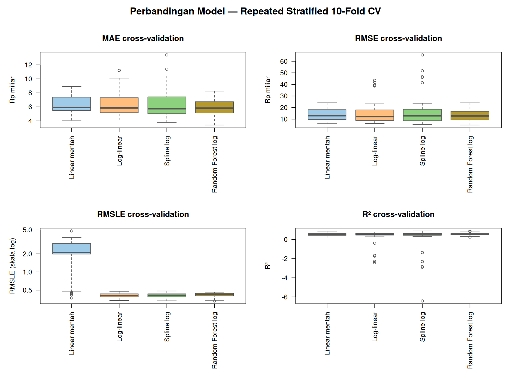
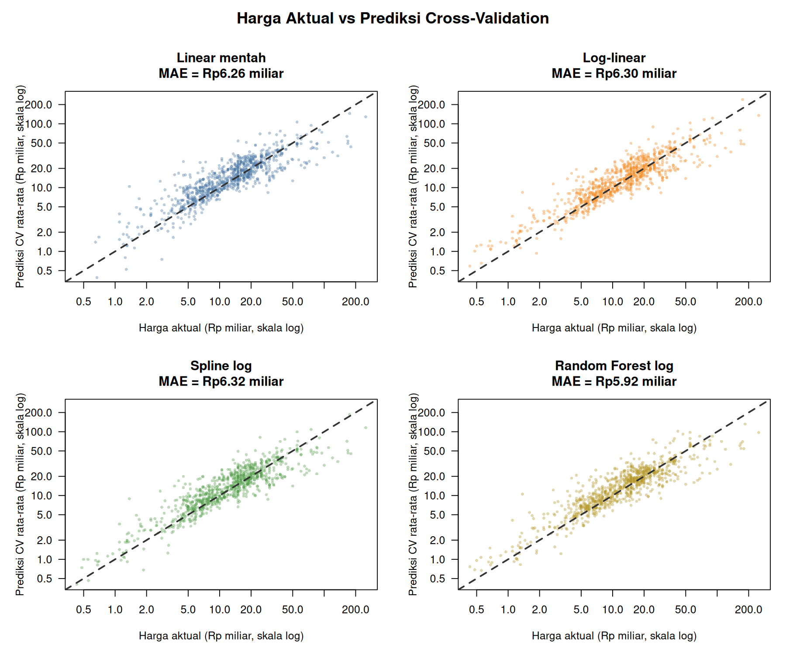
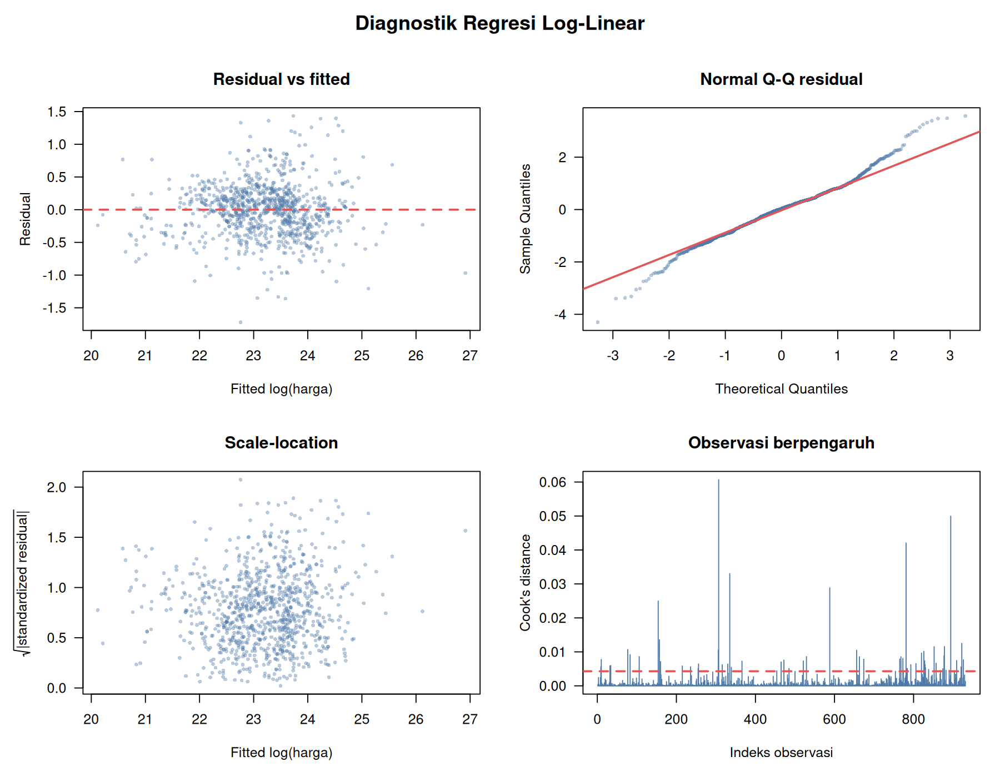
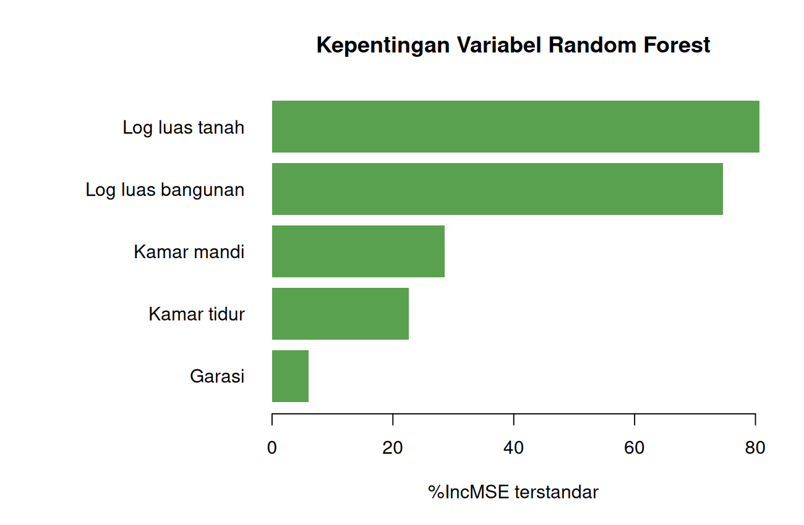

# Pemodelan Harga Rumah Jakarta Selatan

Pemodelan menggunakan 931 observasi pada dataset utama Jakarta Selatan yang telah dibersihkan. Dataset listing tambahan tidak digabungkan karena cakupan sumbernya berbeda.

## Desain evaluasi

- Target: `harga`.
- Prediktor: luas tanah, luas bangunan, kamar tidur, kamar mandi, dan status garasi.
- Validasi: repeated stratified 10-fold cross-validation, 5 pengulangan (50 hasil fold per model). Stratifikasi dilakukan berdasarkan urutan harga.
- Semua pencilan tetap disertakan.
- Model berbasis log dikembalikan ke skala rupiah menggunakan smearing correction.
- MAE digunakan sebagai kriteria utama karena lebih mudah ditafsirkan dan tidak sedominan RMSE terhadap rumah supermewah. RMSLE digunakan untuk menilai kesalahan relatif.

## Perbandingan model

| Model | MAE | RMSE | RMSLE | R² | MAPE |
|---|---:|---:|---:|---:|---:|
| Random Forest log | Rp5,92 miliar | Rp13,21 miliar | 0,416 | 0,566 | 35,6% |
| Linear mentah | Rp6,26 miliar | Rp13,69 miliar | 2,127 | 0,534 | 40,2% |
| Log-linear | Rp6,30 miliar | Rp15,34 miliar | 0,410 | 0,359 | 35,5% |
| Spline log | Rp6,32 miliar | Rp16,33 miliar | 0,411 | 0,212 | 35,2% |

**Random Forest log** memiliki MAE terbaik, sedangkan **Log-linear** memiliki RMSLE terbaik. Pilihan model bergantung pada apakah kesalahan rupiah atau kesalahan relatif lebih penting.

Model dengan MAE terbaik menghasilkan MAE rata-rata **Rp5,92 miliar**, RMSE **Rp13,21 miliar**, dan R² rata-rata **0,566** pada fold validasi.

## Interpretasi regresi log-linear

- Dengan karakteristik lain tetap, kenaikan luas tanah 1% berkaitan dengan perubahan harga sekitar **0,523%** (p robust <0,001).
- Kenaikan luas bangunan 1% berkaitan dengan perubahan harga sekitar **0,678%** (p robust <0,001).
- Tambahan satu kamar tidur berkaitan dengan perubahan harga sekitar **-1,90%**, setelah variabel lain dikendalikan (p robust 0,116).
- Tambahan satu kamar mandi berkaitan dengan perubahan harga sekitar **2,63%** (p robust 0,066).
- Rumah dengan garasi berkaitan dengan perbedaan harga sekitar **9,99%** dibanding rumah tanpa garasi (p robust 0,002).

Interpretasi koefisien menunjukkan asosiasi setelah mengendalikan prediktor yang tersedia, bukan hubungan sebab-akibat.

## Diagnostik

- VIF maksimum adalah **3,91**, sehingga tidak terlihat multikolinearitas berat dengan ambang umum 5.
- Uji Breusch–Pagan menghasilkan p-value **0,002**. Karena itu, tabel koefisien menggunakan standard error HC3 yang tahan heteroskedastisitas.
- Terdapat **59 observasi** dengan Cook's distance di atas 4/n. Observasi tersebut tidak dihapus.

## Batas penggunaan

- Prediksi hanya layak untuk profil rumah yang masih berada dalam cakupan data pelatihan.
- Tidak tersedia kecamatan, koordinat, umur/kondisi bangunan, lebar jalan, atau tanggal observasi. Variabel yang tidak tersedia ini dapat menjelaskan bagian harga yang belum tertangkap model.
- Nilai R² cross-validation per fold dapat berubah karena rumah sangat mahal mempunyai pengaruh besar pada kesalahan skala rupiah.
- Harga pada data merupakan harga listing/dataset, bukan transaksi final yang telah diverifikasi.
- Model Random Forest memerlukan paket R `randomForest` saat objek model akan digunakan kembali.

Tabel rinci, prediksi cross-validation, model akhir, dan informasi sesi tersedia pada subfolder laporan ini.
