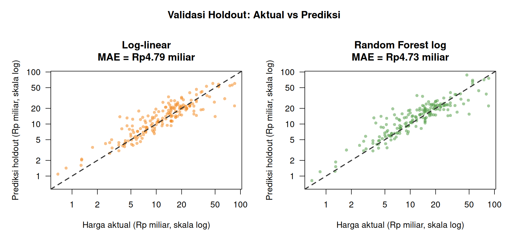
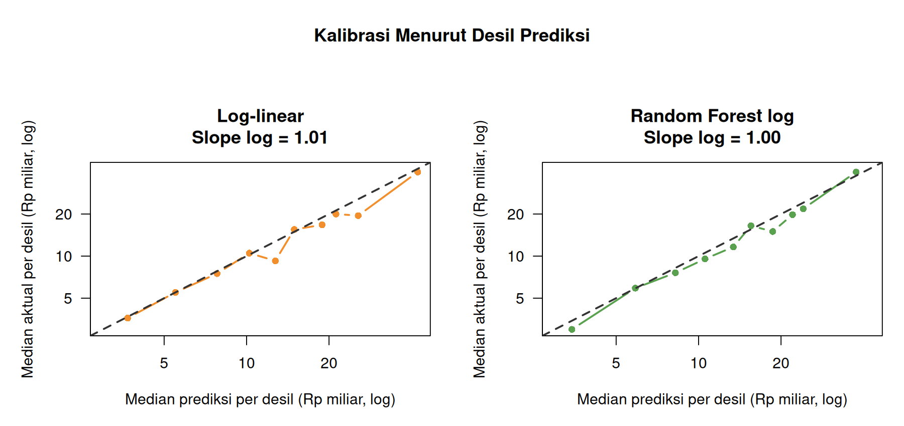
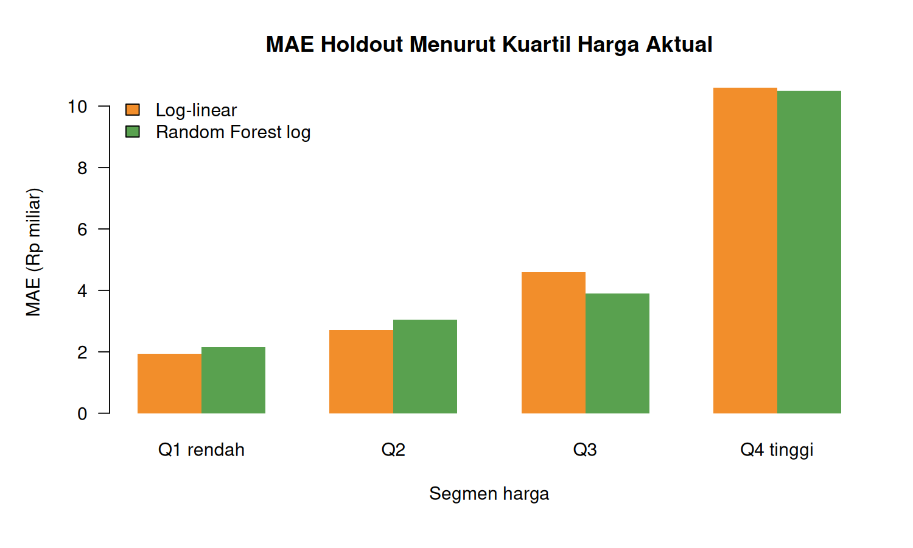
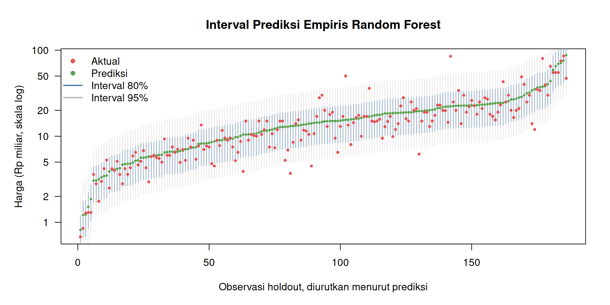

# Validasi Internal Model Harga Rumah

Validasi menggunakan **745 observasi training (80,0%)** dan **186 observasi holdout (20,0%)**. Holdout dibentuk secara terstratifikasi berdasarkan harga dan tidak digunakan untuk melatih model validasi.

## Hasil holdout

| Model | MAE | RMSE | RMSLE | R² | MAPE | Bias relatif |
|---|---:|---:|---:|---:|---:|---:|
| Random Forest log | Rp4,73 miliar | Rp8,92 miliar | 0,382 | 0,647 | 32,3% | 18,5% |
| Log-linear | Rp4,79 miliar | Rp8,67 miliar | 0,380 | 0,667 | 32,3% | 16,9% |
| Spline log | Rp4,90 miliar | Rp9,02 miliar | 0,381 | 0,639 | 32,4% | 17,1% |
| Linear mentah | Rp5,45 miliar | Rp10,08 miliar | 2,097 | 0,548 | 39,3% | 20,0% |

Model dengan MAE holdout terbaik adalah **Random Forest log**, sedangkan RMSLE terbaik diperoleh **Log-linear**.
Untuk Random Forest, MAE holdout adalah **Rp4,73 miliar** dengan interval bootstrap 95% **Rp3,71 miliar–Rp5,93 miliar**. RMSLE-nya **0,382** (95% bootstrap 0,326–0,437).

## Stabilitas dan kalibrasi

- MAE Random Forest pada holdout berubah **-20,2%** dibanding rata-rata cross-validation dan masih berada dalam rentang dua simpangan baku hasil CV.
- Calibration slope Random Forest pada skala log adalah **1,003**; nilai ideal adalah 1.
- Median rasio prediksi terhadap aktual Random Forest adalah **1,096**.

## Ketidakpastian dan segmen harga

- Interval prediksi empiris Random Forest 80% mencakup **83,9%** harga aktual; interval 95% mencakup **96,2%**.
- Median lebar interval prediksi 95% Random Forest mencapai **Rp29,52 miliar**, sehingga cakupan yang baik tetap disertai ketidakpastian yang lebar.
- MAE Random Forest meningkat menjadi **Rp10,50 miliar** pada kuartil harga tertinggi. Ini menunjukkan bahwa rumah supermewah belum diprediksi dengan stabil oleh variabel yang tersedia.
- Tabel sensitivitas memisahkan hasil untuk observasi dengan dan tanpa flag pencilan IQR; tidak ada pencilan yang dihapus dari evaluasi utama.

## Kesimpulan validasi

Random Forest menunjukkan stabilitas dan kalibrasi internal yang memadai untuk estimasi awal, tetapi belum tervalidasi secara eksternal.

Validasi ini masih bersifat **internal**. Formulasi model telah dibandingkan pada dataset yang sama di tahap sebelumnya, sehingga holdout ini bukan pengganti validasi eksternal. Dataset juga tidak memiliki kecamatan, koordinat, umur dan kondisi bangunan, lebar jalan, maupun tanggal observasi. Sebelum dipakai untuk keputusan finansial atau penilaian properti nyata, model perlu diuji pada data Jakarta Selatan lain yang benar-benar berasal dari periode dan sumber berbeda.

Model pada folder validasi hanya dilatih dengan partisi training. Model akhir dari tahap pemodelan sebelumnya, yang dilatih dengan seluruh data, tidak diubah.
